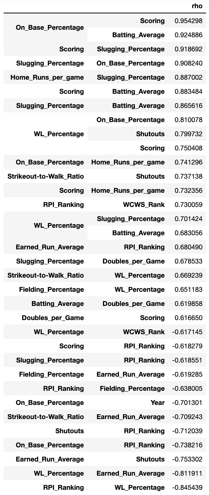
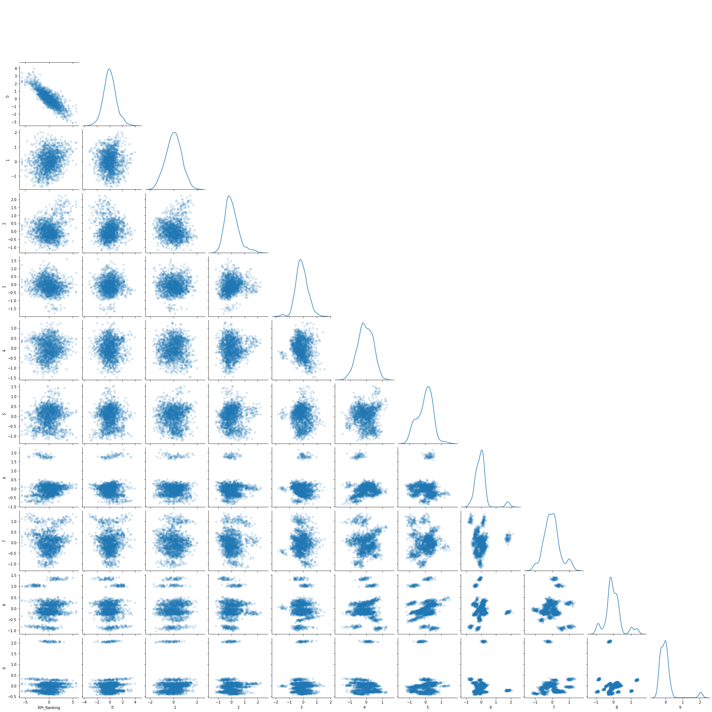
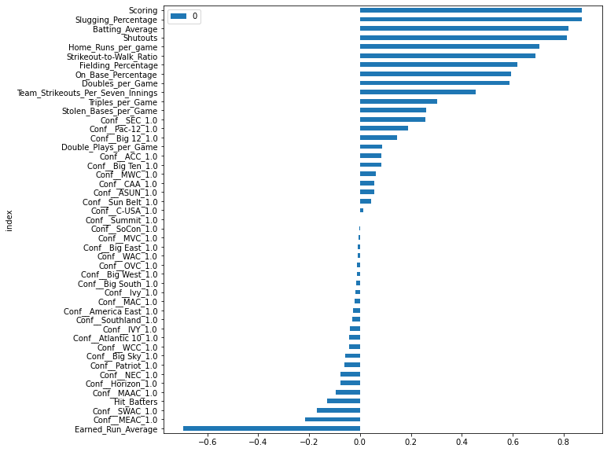
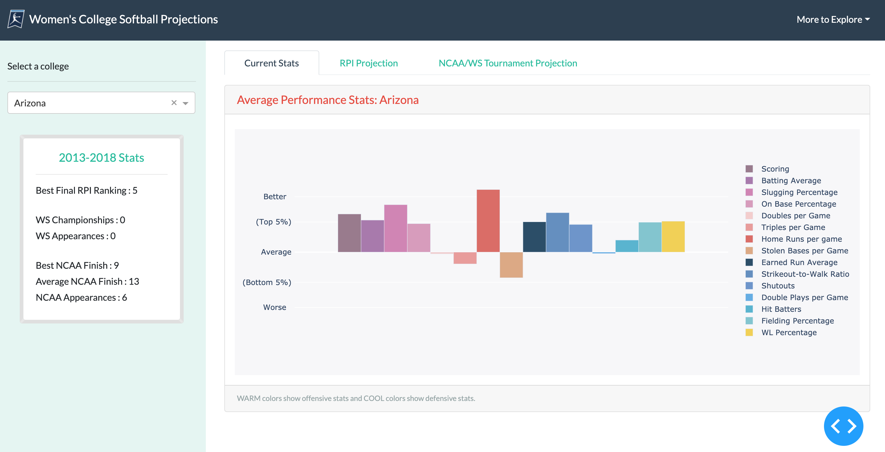
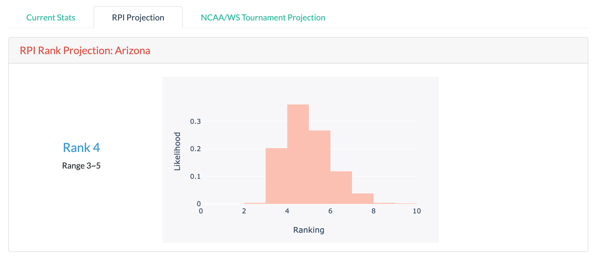
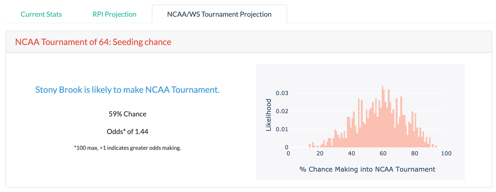
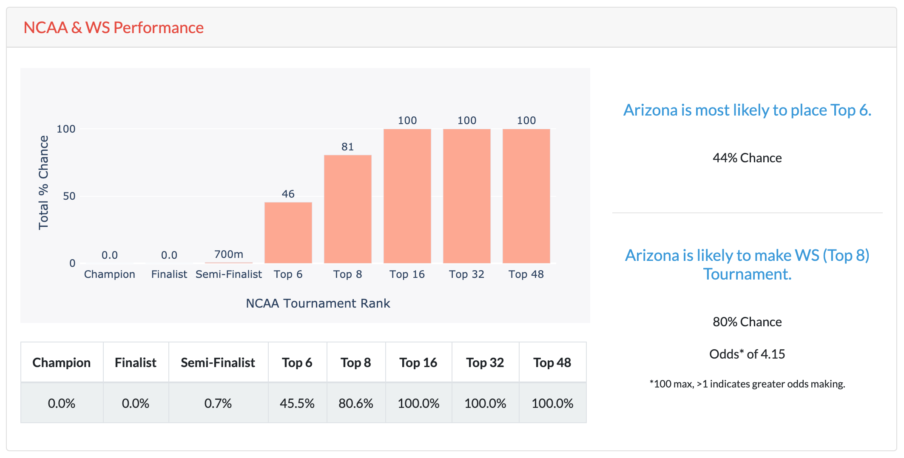

# NCAA Women's College Softball League Performance Projections
Will my favorite team win this year? How far will it go? Beta version (on-going progress at patternsnobs.com)<br>
Koeun Lim (koeunlim@alum.mit.edu) <br>
Kevin Haghi(kevin.haghi@gmail.com) <br>

## Table of Contents
[Directory Structure](#Directory-Structure)<br>
[Project Description](#Project-Description)<br>
[Data Description](#Data-Description)<br>
-[Source](#Source)<br>
[EDA & Feature Engineering](#EDA-&-Feature-Engineering)<br>
[Modeling & Interactive Visualization](#Modeling-&-Interactive-Visualization)<br>
[Conclusion](#Conclusion)<br>


## Directory Structure
```
.
├── NCAA Softball Projections
    ├── 01_NCAA_Softball_getStats.ipynb
    ├── 02_NCAA_Softball_CleanData.ipynb
    ├── 03_NCAA_Softball_EDA.ipynb
    ├── 04_NCAA_Softball_Imputation & PCA.ipynb
    ├── 05_NCAA_Softball_Model1_RPI_LinearRegression.ipynb
    ├── 06_NCAA_Softball_Model2_WS64Seed_Logistic_famd-stratified.ipynb
    ├── 07_NCAA_Softball_Model3_WS_Ranking_Logistic_famd-stratified.ipynb
    ├── 08_NCAA_Softball_Dashboard_tryTabs.ipynb
    ├── Data
        ├── Webscraped
            ├── NCAAstats
            ├── RPI
            ├── WCWSresults
        ├── Cleaned
    ├── ModelPredictions
        ├── RPI
        ├── WS64Seeds
        ├── WSRank
    ├── Figures
    ├── README.md
```


## Project Description
Women’s sports are underrepresented across sports networks, betting, and accessible content.  What is one way to increase interest and intrigue around women’s sports?  Information.  When the sports networks have fascinating stats that describe players, teams, and matchups, it gives newscasters the ability to deliver a narrative to their viewers and hype up women’s sporting events.  It is a way for viewers to get to know players and teams.  And at the end of the day, while we are watching these teams play, we fall in love with these players and vicariously come along with them on their trip.

This project is our way to deliver more attention to women’s sports that is indeed deserved.  
The perfect sport to test this hypothesis around is NCAA Women’s College Softball.  Baseball, just like Softball, is a stat-driven sport.  We scraped historical softball stats from the past 7 years and generated a model to predict: The Rating Percentage Index (RPI), The NCAA Tournament Field, and projected finish in the tournament.  Included in this package is a dashboard of relavent stat rankings, the team history, and their projections.  

These kinds of stats mirror stats that are already available for men’s sports and are perfect content creators for outlets like: 7Innings podcast, In the circle fastpitch podcast, and ESPN.  Many of the podcasters also spend a good amount of time on ESPN during highly anticipated women’s softball games.  Consequently, better statistical model will proliferate betting on women’s sports.  And being a long-time lover of women’s sports and statistics, there is no better way to give back than by helping in the way we can to lift women’s sports to where they deserve and need to be.  


## Data Description
### Output Variables
Name of the column|Description|Levels|
|---|---|---|
|RPI_Ranking|Final RPI ranking for the year|1~300||
|WCWS_in|Tournament appearance|0 (out), 1 (in)||
|WCWS_Rank|Tournament final ranking|Champion, Finalist, Semi-finalist, Top 6, Top 8, Top 16, Top 32, Top 48, Top64||

### Input Variables
Name of the column|Description|Data type|
|---|---|---|
|College|Name of the team|Nominal, ID||
|Conference|Name of the conference|Nominal||
|Year|Season period|2013~2019||
|Fielding_Percentage|Percentage of times a defensive player properly handles a batted or thrown ball|Numerical||
|Scoring|Average score per game|Numerical||
|WL_Percentage|Won games divided by lost games|Numerical||
|Hit_Batters|Number of balls hitting batters|Numerical||
|Earned_Run_Average|Number of earned runs a pitcher allows per seven innings|Numerical||
|Triples_per_Game|Number of reaching third base with one hit per game|Numerical||
|Home_Runs_per_game|Number of home runs per game|Numerical||
|Slugging_Percentage|Total bases divided by at bats|Numerical||
|Double_Plays_per_Game|Two offensive players ruled out within the same play|Numerical||
|On_Base_Percentage|Measure of how often a batter reaches base|Numerical||
|Stolen_Bases_per_Game|Number of advancing one base without other aids|Numerical||
|Strikeout-to-Walk_Ratio|Strikeouts divided by walks|Numerical||
|Batting_Average|Hits divided by total at-bats|Numerical||
|Doubles_per_Game|Number of reaching second base with one hit per game|Numerical||
|Shutouts|Starting pitcher pitching the entire game for a team and does not allow the opposition to score|Numerical||
|Team_Strikeouts_Per_Seven_Innings|Strikeouts per seven innings|Numerical||

Training/Test set: 2013-2018<br>
Validation set: 2019<br>
*Year 2020 not available due to COVID19*<br>


### Source
Stats data were gathered from [NCAA Statistics](https://stats.ncaa.org/)<br>
RPI, conference, tournament data were gathered from [NCAA](https://www.ncaa.com/)<br>


## EDA & Feature Engineering
### Pairplots of all input/output variables

<br> Intercorrelations among input features are apparent from the pair plots.
<br>

### Table of input variables with high crosscorrelations

<br>
Because input variables (game stats) are highly intercorrelated (|rho| > 0.6), regression/classification models will suffer from multicollinearity, making models difficult to interpret. In order to resolve multicollinearity, factor analysis for mixed data (FAMD) was performed to tranform features into orthogonal space. FAMD was chosen over principal component analysis (PCA) since conferences are categorical variables while other stats are numerical variables.
<br>

### Pairplots of RPI ranking and FAMD of all input variables

<br>
This pairplots show that FAMD removes most of the correlations between the input variables. Furthermore, Component 0 is the only component that varies systematically with RPI ranking while other component do not vary with RPI. 
<br>

### FAMD Component 0

<br>
This bar plot shows which features are positively/negatively correlated with Component 0 by how much. All stats are positively correlated with Component 0 while Hit Batters and Earned Run Average are negatively correlated with Component 0. We can also see which conferences stand out to have strongest positve/negative correlations with Component 0.
<br>
Since FAMD successfully decoupled correlated features and transformed them into orthogonal components, all of the modelings were done using FAMD components.


## Modeling & Interactive Visualization
### Dashboard Overview

<br>
Interactive dashboard was developed using Jupyter dash. User can choose a college team to observe its stats (first tab) compared to the other teams as well as its projections (second and third tabs). 

### Dashboard - RPI Projection

<br>
RPI projection model was developed using linear regression with inverse logistic function as the link function. The validation R2 was 0.904. Bootstrap with replacement of N=1000 was performed to generate the distribution of the possible outcomes. The range of the rank projection covers 25% and 75% quantiles.
<br>

### Dashboard - NCAA Tournament Appearance Projection

<br>
Out of approximately 300 teams, top 64 teams make into the NCAA tournament at the end of the season each year. The model to predict the likelihood of a team's making the top 64 was developed using Stochastic Gradient Descent classifier with logistic function as the link function. The validation accuracy was 88.2% with 0.719 sensitivity and 0.923 specificity where the chance level accuracy is 66.2%. Since it is imbalanced data, boostrap of N=1000 was performed with stratified resampling to estimate the probability distribution of the possible outcomes (chance making into the tournament). 
<br>

### Dashboard - NCAA/WS Tournament Performance Projection

<br> 
In order to predict how far a team makes into the tournament, multinomial classification model was developed. There are 9 classes - Champion, Finalist, Semi-finalist, Top 6, Top 8 (World Series), Top 16, Top 32, Top 48, Top 64. Overall accuracy of the model was 84.5%. For each categories, Top 48 prediction achieved 68.75% accuracy, Top 32 achieved 84.4%, Top 16 achieved 75%, Top 8 achieved 50%, Top 6 achieved 66.7%, Semi-finalist prediction achieved 75%, and Finlaist prediction achieved 50% accuracy (chance level accuracy for Finalist prediction is 0.67%). Based on 1,000 simulations, the cumulative probability of making into each category was estimated. Also, the most likely final placement was estimated as well as the likelihood of making into World Series Tournament (Top 8). 
<br>


## Future Direction
This is a seed project for developing more comprehensive models to understand and make projections on women's college softball games. We wanted to first see if aggregate game stats can provide sufficient information to describe and predict long-term game performances such as tournament appearance and final placement. Relatively simple models were able to predict above chance levels with plenty room for improvement, indicating that more intricate models with per-game stats and individual player line up can substantially increase the accuracy of the model. Progress is to be updated at [patternsnobs.com](https://www.patternsnobs.com).  

