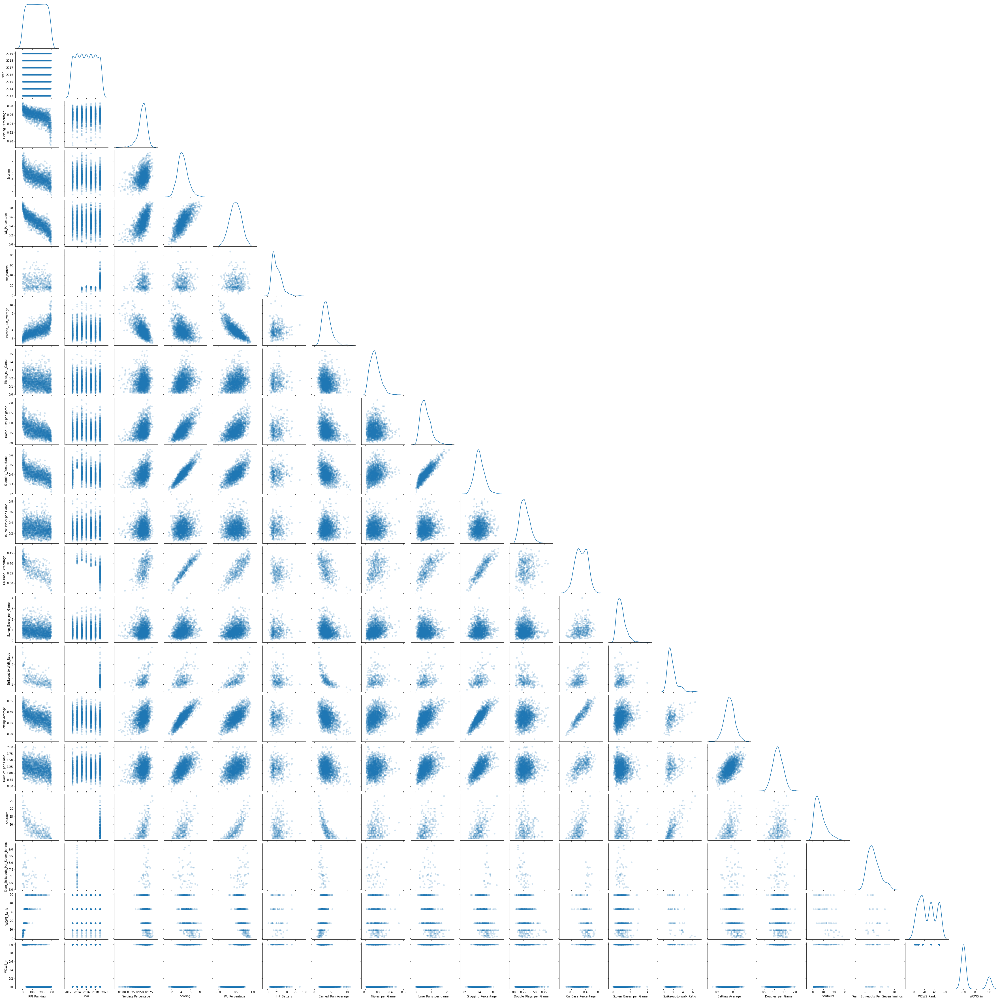

# NCAA Women's College Softball League Performance Projections
Will my favorite team win this year? How far will it go? Beta version. <br>
Koeun Lim (koeunlim@alum.mit.edu) <br>
Kevin Haghi(kevin.haghi@gmail.com) <br>

## Table of Contents
[Directory Structure](#Directory-Structure)<br>
[Project Description](#Project-Description)<br>
[Data Description](#Data-Description)<br>
-[Source](#Source)<br>
[Data Visualization](#Data-Visualization)<br>
[Conclusion](#Conclusion)<br>


## Directory Structure
```
.
├── NCAA Softball Projections
    ├── 01_NCAA_Softball_getStats.ipynb
    ├── 02_NCAA_Softball_CleanData.ipynb
    ├── 03_NCAA_Softball_EDA.ipynb
    ├── 04_NCAA_Softball_Imputation & PCA.ipynb
    ├── 05_NCAA_Softball_Model1_RPI_LinearRegression.ipynb
    ├── 06_NCAA_Softball_Model2_WS64Seed_Logistic_famd-stratified.ipynb
    ├── 07_NCAA_Softball_Model3_WS_Ranking_Logistic_famd-stratified.ipynb
    ├── 08_NCAA_Softball_Dashboard_tryTabs.ipynb
    ├── Data
        ├── Webscraped
            ├── NCAAstats
            ├── RPI
            ├── WCWSresults
        ├── Cleaned
    ├── ModelPredictions
        ├── RPI
        ├── WS64Seeds
        ├── WSRank
    ├── Figures
    ├── README.md
```


## Project Description
Women’s sports are underrepresented across sports networks, betting, and accessible content.  What is one way to increase interest and intrigue around women’s sports?  Information.  When the sports networks have fascinating stats that describe players, teams, and matchups, it gives newscasters the ability to deliver a narrative to their viewers and hype up women’s sporting events.  It is a way for viewers to get to know players and teams.  And at the end of the day, while we are watching these teams play, we fall in love with these players and vicariously come along with them on their trip.

This project is our way to deliver more attention to women’s sports that is indeed deserved.  
The perfect sport to test this hypothesis around is NCAA Women’s College Softball.  Baseball, just like Softball, is a stat-driven sport.  We scraped historical softball stats from the past 6 years and generated a model to predict: The Rating Percentage Index (RPI), The NCAA Tournament Field, and projected finish in the tournament.  Included in this package is a dashboard of relavent stat rankings, the team history, and their projections.  

These kinds of stats mirror stats that are already available for men’s sports and are perfect content creators for outlets like: 7Innings podcast, In the circle fastpitch podcast, and ESPN.  Many of the podcasters also spend a good amount of time on ESPN during highly anticipated women’s softball games.  Consequently, better statistical model will proliferate betting on women’s sports.  And being a long-time lover of women’s sports and statistics, there is no better way to give back than by helping in the way we can to lift women’s sports to where they deserve and need to be.  


## Data Description
### Output Variables
Name of the column|Description|Levels|
|---|---|---|
|RPI_Ranking|Final RPI ranking for the year|1~300||
|WCWS_in|Tournament appearance|0 (out), 1 (in)||
|WCWS_Rank|Tournament final ranking|Champion, Finalist, Semi-finalist, Top 6, Top 8, Top 16, Top 32, Top 48, Top64||

### Input Variables
Name of the column|Description|Data type|
|---|---|---|
|College|Name of the team|Nominal, ID||
|Conference|Name of the conference|Nominal||
|Year|Season period|2013~2019||
|Fielding_Percentage|Percentage of times a defensive player properly handles a batted or thrown ball|Numerical||
|Scoring|Average score per game|Numerical||
|WL_Percentage|0|Numerical||
|Hit_Batters|0|Numerical||
|Earned_Run_Average|0|Numerical||
|Triples_per_Game|0|Numerical||
|Home_Runs_per_game|0|Numerical||
|Slugging_Percentage|0|Numerical||
|Double_Plays_per_Game|0|Numerical||
|On_Base_Percentage|0|Numerical||
|Stolen_Bases_per_Game|0|Numerical||
|Strikeout-to-Walk_Ratio|Numerical|0||
|Batting_Average|0|Numerical||
|Doubles_per_Game|0|Numerical||
|Shutouts|0|Numerical||
|Team_Strikeouts_Per_Seven_Innings|0|Numerical||

Training/Test set: 2013-2018<br>
Validation set: 2019<br>
*Year 2020 not available due to COVID19*<br>


### Source
Product data were gathered from [Sephora](https://www.sephora.com/)<br>
Product review data were gathered from [Bazaarvoice](https://api.bazaarvoice.com)<br>


## Data Visualization
Pairplots of all input/output variables<br>



## Conclusion
